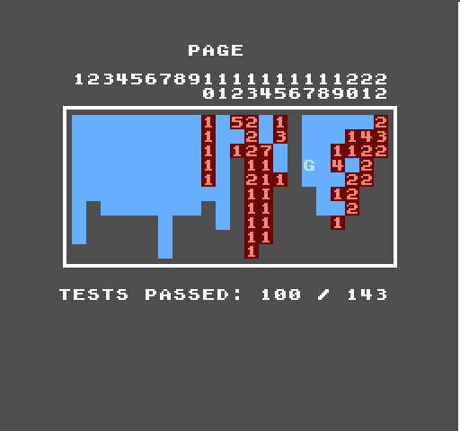
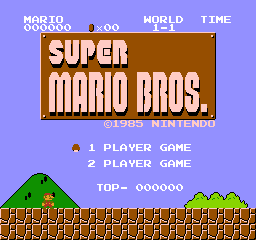
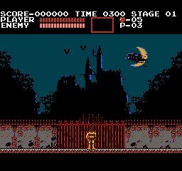
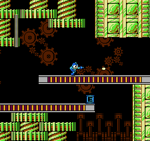
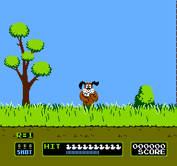
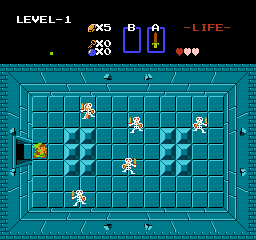
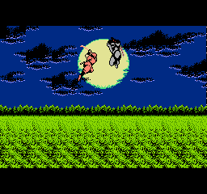

# TimeNES
NES Emulator built in Go

This emulator began from the guide by [100th_Coin](https://www.patreon.com/100th_Coin/posts/making-your-nes-137873901), and has since expanded with additional features / accuracy. Some games still have visual bugs, but support is ongoing.

Currently supports:
- APU Support
- Cycle-accurate CPU
- Pause / Reset / Mute game
- 2 players
- All 161 official instructions
- Debugging features

Currently supported mapper chips:
+ [x] 001: MMC1
+ [x] 002: UxROM
+ [x] 003: CNROM
+ [x] 004: MMC3
+ [x] 007: AxROM

Things to add:

- NTSC Video Rendering
- AccuracyCoin tests (77 / 141)
- Additional controller support (eg. Zapper)
- Save stating
- TAS Support

  

  
